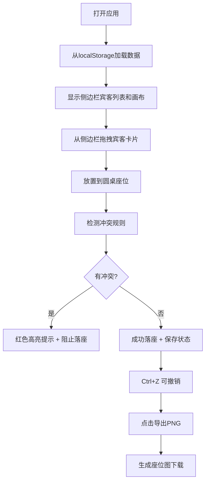

## 1. 产品概述

年夜饭座位编排器是一款专为中国家庭设计的可视化座位规划工具，解决传统纸笔规划效率低、冲突难发现的痛点。通过拖拽式交互和智能冲突检测，帮助用户快速完成20-100人规模的团圆饭座位安排，兼顾长幼有序的传统礼仪与现代家庭的复杂关系。

**核心价值**：
- 可视化圆桌布局，支持8/10/12人三种规格
- 智能冲突检测，避免前任同桌、长辈错位等尴尬
- 一键导出座位图，方便家族群分享
- 自动保存进度，随时继续编辑

## 2. 核心功能

### 2.1 功能模块
1. **宾客管理模块**：侧边栏宾客列表、卡片拖拽、添加/编辑/删除宾客
2. **画布编排模块**：无限画布、圆桌放置、座位落座、拖拽移动
3. **冲突检测模块**：规则配置、实时检测、红色高亮阻止落座
4. **操作历史模块**：Ctrl+Z 撤销/重做、操作历史栈
5. **导出分享模块**：PNG 导出、高清晰度渲染
6. **数据持久化模块**：localStorage 自动保存

### 2.2 页面详情
| 页面名称 | 模块名称 | 功能描述 |
|---------|----------|----------|
| 主编排页 | 顶部工具栏 | 添加圆桌、撤销/重做按钮、导出PNG、冲突规则配置入口 |
| 主编排页 | 左侧宾客栏 | 宾客卡片列表（姓名+辈分标签+忌口备注）、可拖拽 |
| 主编排页 | 中央画布区 | 无限画布、圆桌显示、座位落座、拖拽移动、多选框选 |
| 主编排页 | 冲突规则弹窗 | 规则列表、添加规则（不可同桌/必须隔桌/必须相邻） |

## 3. 核心流程

## 4. 用户界面设计

### 4.1 设计风格
- **主色调**：中国红 `#C41E3A`（喜庆传统）+ 金色 `#D4AF37`（尊贵典雅）
- **辅助色**：深木色 `#3E2723`（木质圆桌质感）+ 米白 `#FAFAF0`（宣纸质感背景）
- **字体**：标题用「Noto Serif SC」（宋体风格，传统庄重），正文用「Noto Sans SC」（现代清晰）
- **按钮风格**：圆角8px，微立体阴影，hover 有金色描边
- **布局风格**：三栏布局（左宾客栏 + 中画布 + 右可选信息栏），顶部固定工具栏
- **图标风格**：使用 lucide-react 图标，搭配传统中国风元素装饰

### 4.2 页面设计概述
| 页面名称 | 模块名称 | UI 元素 |
|---------|----------|----------|
| 主编排页 | 顶部工具栏 | 中国红背景、金色图标、按钮组（添加桌位/撤销/重做/导出/规则配置） |
| 主编排页 | 宾客侧边栏 | 米白背景、卡片式宾客列表、拖拽时半透明效果、辈分标签颜色区分（长辈金紫/平辈蓝/晚辈绿） |
| 主编排页 | 中央画布 | 宣纸纹理背景、深棕色木质圆桌、座位环形排列、冲突时红色闪烁边框 |
| 主编排页 | 冲突规则弹窗 | 毛玻璃背景、规则卡片、添加规则表单、规则类型标签 |

### 4.3 响应性
- **桌面端优先**：1280px 以上完整三栏布局
- **平板适配**：1024-1279px 折叠宾客栏为可滑动抽屉
- **交互优化**：拖拽时使用 CSS transform + GPU 加速，确保100人规模下60fps

### 4.4 视觉细节
- 圆桌使用 radial-gradient 模拟木质纹理和立体感
- 宾客卡片使用 paper-texture 背景，轻微阴影
- 拖拽时卡片有 rotate(-2deg) 自然倾斜效果
- 落座成功有金色光圈扩散动画
- 冲突检测失败有红色震动抖动效果
