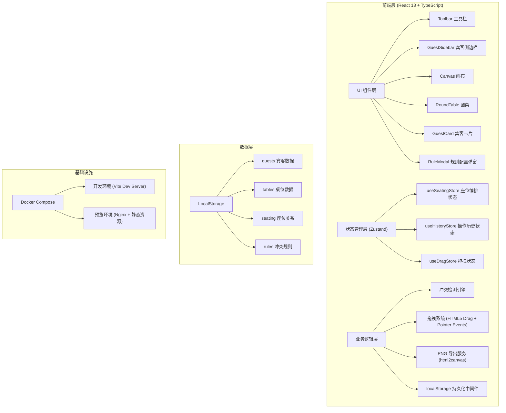
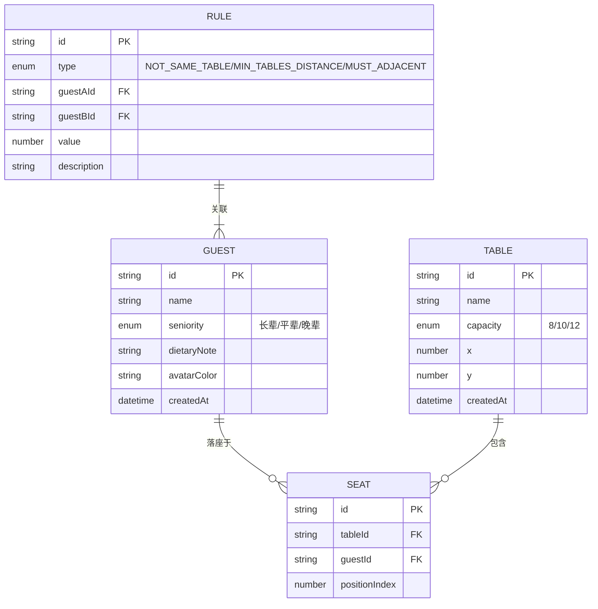

## 1. 架构设计



## 2. 技术描述

- **前端框架**：React@18 + TypeScript@5 + Vite@5
- **状态管理**：Zustand@4（轻量级、支持 immer 中间件、支持 persist 中间件）
- **样式方案**：TailwindCSS@3 + CSS Variables（主题系统）
- **图标库**：lucide-react（符合设计要求的现代图标）
- **拖拽方案**：原生 HTML5 Drag and Drop API + 自定义 Pointer Events（100人规模性能优化）
- **导出功能**：html2canvas（高质量 PNG 渲染）
- **数据持久化**：Zustand persist 中间件 + localStorage
- **初始化工具**：vite-init 脚手架

## 3. 核心数据模型

### 3.1 数据模型定义



### 3.2 TypeScript 类型定义

```typescript
type Seniority = 'elder' | 'peer' | 'junior';
type TableCapacity = 8 | 10 | 12;
type RuleType = 'NOT_SAME_TABLE' | 'MIN_TABLES_DISTANCE' | 'MUST_ADJACENT';

interface Guest {
  id: string;
  name: string;
  seniority: Seniority;
  dietaryNote: string;
  avatarColor: string;
  createdAt: number;
}

interface Table {
  id: string;
  name: string;
  capacity: TableCapacity;
  x: number;
  y: number;
  createdAt: number;
}

interface Seat {
  id: string;
  tableId: string;
  guestId: string | null;
  positionIndex: number;
}

interface Rule {
  id: string;
  type: RuleType;
  guestAId: string;
  guestBId: string;
  value?: number;
  description: string;
}

interface ConflictResult {
  hasConflict: boolean;
  rule: Rule | null;
  message: string;
}

interface HistoryState {
  past: AppState[];
  future: AppState[];
}
```

## 4. 状态管理设计

### 4.1 Zustand Store 结构

```typescript
// useSeatingStore.ts
interface SeatingState {
  guests: Guest[];
  tables: Table[];
  seats: Seat[];
  rules: Rule[];
  selectedGuestIds: string[];
  selectedTableId: string | null;
  draggingGuestId: string | null;
  hoveredSeatId: string | null;
  
  // Actions
  addGuest: (guest: Omit<Guest, 'id' | 'createdAt'>) => void;
  removeGuest: (id: string) => void;
  updateGuest: (id: string, updates: Partial<Guest>) => void;
  
  addTable: (table: Omit<Table, 'id' | 'createdAt'>) => void;
  removeTable: (id: string) => void;
  updateTable: (id: string, updates: Partial<Table>) => void;
  
  seatGuest: (guestId: string, tableId: string, positionIndex: number) => ConflictResult;
  unseatGuest: (guestId: string) => void;
  moveGuest: (guestId: string, newTableId: string, newPositionIndex: number) => ConflictResult;
  
  addRule: (rule: Omit<Rule, 'id'>) => void;
  removeRule: (id: string) => void;
  
  selectGuest: (id: string, multi?: boolean) => void;
  clearSelection: () => void;
  moveSelectedGuests: (deltaX: number, deltaY: number) => void;
  
  checkConflicts: (guestId: string, tableId: string) => ConflictResult;
}
```

### 4.2 操作历史实现

使用 Zustand 中间件实现撤销/重做：
- 维护 `past` 数组存储历史状态
- 维护 `future` 数组存储重做状态
- 每次状态变更前 push 到 `past`
- Ctrl+Z 触发 undo，从 `past` pop 并替换当前状态
- Ctrl+Y 触发 redo，从 `future` pop 并替换当前状态

## 5. 性能优化策略

### 5.1 拖拽性能优化
- 使用 `transform: translate3d()` 而非 `top/left`，启用 GPU 加速
- 拖拽时添加 `will-change: transform`
- 使用 `requestAnimationFrame` 节流位置更新
- 宾客卡片使用 `React.memo` 避免不必要重渲染
- 拖拽状态通过独立 store 管理，减少重渲染范围

### 5.2 大规模渲染优化
- 画布使用 CSS `contain: strict` 隔离重绘
- 宾客列表虚拟滚动（100人时可选）
- 使用 `useDeferredValue` 延迟非关键更新
- 冲突检测使用缓存，避免重复计算

## 6. 冲突检测引擎

```typescript
// conflictEngine.ts
class ConflictDetectionEngine {
  private rules: Rule[];
  private tables: Table[];
  private seats: Seat[];
  
  constructor(rules: Rule[], tables: Table[], seats: Seat[]) {
    this.rules = rules;
    this.tables = tables;
    this.seats = seats;
  }
  
  public check(guestId: string, targetTableId: string): ConflictResult {
    for (const rule of this.rules) {
      const result = this.checkRule(rule, guestId, targetTableId);
      if (result.hasConflict) {
        return result;
      }
    }
    return { hasConflict: false, rule: null, message: '' };
  }
  
  private checkRule(rule: Rule, guestId: string, targetTableId: string): ConflictResult {
    const { type, guestAId, guestBId, value } = rule;
    
    if (guestId !== guestAId && guestId !== guestBId) {
      return { hasConflict: false, rule: null, message: '' };
    }
    
    const otherGuestId = guestId === guestAId ? guestBId : guestAId;
    const otherGuestTableId = this.getGuestTableId(otherGuestId);
    
    if (!otherGuestTableId) {
      return { hasConflict: false, rule: null, message: '' };
    }
    
    switch (type) {
      case 'NOT_SAME_TABLE':
        if (otherGuestTableId === targetTableId) {
          return {
            hasConflict: true,
            rule,
            message: rule.description || `${this.getGuestName(guestAId)} 与 ${this.getGuestName(guestBId)} 不可同桌`
          };
        }
        break;
        
      case 'MIN_TABLES_DISTANCE':
        const distance = this.calculateTableDistance(targetTableId, otherGuestTableId);
        if (distance < (value || 1)) {
          return {
            hasConflict: true,
            rule,
            message: rule.description || `${this.getGuestName(guestAId)} 与 ${this.getGuestName(guestBId)} 必须至少间隔 ${value} 桌`
          };
        }
        break;
        
      case 'MUST_ADJACENT':
        if (otherGuestTableId === targetTableId) {
          const positions = this.getAdjacentPositions(targetTableId);
          // 检查是否相邻座位
        }
        break;
    }
    
    return { hasConflict: false, rule: null, message: '' };
  }
  
  private getGuestTableId(guestId: string): string | null {
    const seat = this.seats.find(s => s.guestId === guestId);
    return seat?.tableId || null;
  }
  
  private calculateTableDistance(tableIdA: string, tableIdB: string): number {
    // 根据桌位坐标计算桌间距离，转换为桌数单位
    const tableA = this.tables.find(t => t.id === tableIdA)!;
    const tableB = this.tables.find(t => t.id === tableIdB)!;
    const pixelDistance = Math.sqrt(
      Math.pow(tableA.x - tableB.x, 2) + Math.pow(tableA.y - tableB.y, 2)
    );
    return Math.floor(pixelDistance / 300); // 假设每桌间距约300px
  }
}
```

## 7. Docker Compose 配置

```yaml
services:
  dev:
    build:
      context: .
      dockerfile: Dockerfile.dev
    ports:
      - "5173:5173"
    volumes:
      - .:/app
      - /app/node_modules
    environment:
      - NODE_ENV=development
    command: npm run dev

  preview:
    build:
      context: .
      dockerfile: Dockerfile
    ports:
      - "8080:80"
    environment:
      - NODE_ENV=production
```

## 8. 目录结构

```
src/
├── components/
│   ├── Toolbar/
│   ├── GuestSidebar/
│   ├── Canvas/
│   ├── RoundTable/
│   ├── GuestCard/
│   ├── SeatSlot/
│   └── RuleModal/
├── hooks/
│   ├── useDragDrop.ts
│   ├── useKeyboardShortcuts.ts
│   └── useCanvasPan.ts
├── store/
│   ├── useSeatingStore.ts
│   ├── useHistoryStore.ts
│   └── persistMiddleware.ts
├── engine/
│   └── ConflictDetectionEngine.ts
├── utils/
│   ├── exportPNG.ts
│   ├── idGenerator.ts
│   └── colors.ts
├── types/
│   └── index.ts
├── data/
│   └── mockData.ts
├── App.tsx
└── main.tsx
```
